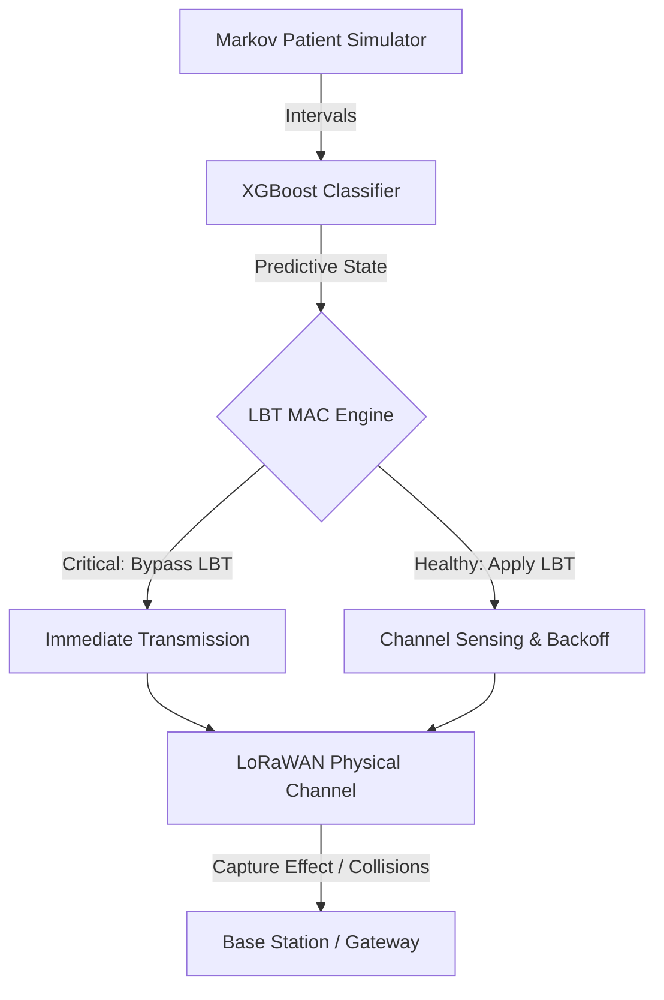

# Intelligent Traffic Management for Scalable and Reliable IoMT Networks

[](https://www.python.org/)
[](#installation--deployment)
[](https://simpy.readthedocs.io/)
[](https://xgboost.readthedocs.io/)

An end-to-end, discrete event simulation framework for evaluating traffic management in Internet of Medical Things (IoMT) networks. Using a pre-trained XGBoost Classifier to dynamically predict patient health states from transmission intervals, this project implements a Classifier-Driven Listen-Before-Talk (LBT) channel access scheme to prioritize critical medical packets, logs comprehensive transmission statistics, and evaluates system scalability up to 12,000 nodes.

This codebase accompanies the following academic publications:
1. **Paper Title**: *Intelligent Traffic Management for Scalable and Reliable IoMT Networks Supporting Remote Monitoring of Patients*
   * **Citation Link**: [Google Scholar](https://scholar.google.com/citations?view_op=view_citation&hl=en&user=SQ7A23YAAAAJ&citation_for_view=SQ7A23YAAAAJ:u5HHmVD_uO8C)
2. **Conference Article**: *#22 (1571313212): A Machine Learning-Assisted Traffic Management for Remote Health Monitoring using LoRaWAN*

---

## Table of Contents
* [Short Description](#short-description)
* [Background & Architecture](#background--architecture)
* [Dependencies & Prerequisites](#dependencies--prerequisites)
* [Installation & Deployment](#installation--deployment)
* [Uninstallation & Cleanup](#uninstallation--cleanup)
* [Configuration](#configuration)
* [Usage & Examples](#usage--examples)
* [Simulation Metrics](#simulation-metrics)
* [Publications & Citations](#publications--citations)
* [Maintainers & Contributors](#maintainers--contributors)
* [Contributing](#contributing)

---

## Short Description
This repository integrates a discrete-event LoRaWAN simulator (built on SimPy) with a machine learning classification stack. It simulates IoMT wearables transitioning between healthy and critical clinical states using a Markov Chain. A pre-trained XGBoost classifier predicts these states on the fly based on transmission history, and a classifier-driven Listen-Before-Talk (LBT) protocol suppresses channel access delays for nodes in critical states, significantly improving the Data Extraction Rate (DER) of critical healthcare events.

---

## Background & Architecture
The system operates as a modular architecture consisting of the following core components:

1. **IoMT Patient State Simulator**: Simulates patient condition changes using a two-state Markov Chain (`Healthy` vs. `Not-Healthy`) governed by transition probabilities $p$ and $q$.
2. **Traffic Generator**: Implements exponential transmission intervals with rates derived from the patient's state (acute/chronic clinical states).
3. **ML Classifier Backend**: A tree-based model (XGBoost) trained on sliding windows of historical transmission intervals ($K$-intervals) to predict patient status in real-time.
4. **Medium Access Control (MAC) Layer**:
   * *ALOHA Baseline*: Standard collision-prone LoRaWAN transmission.
   * *Plain LBT Baseline*: Standard Listen-Before-Talk channel check applied to all nodes.
   * *Classifier-Driven LBT (Proposed)*: Critical nodes bypass channel sensing to transmit immediately, while non-critical nodes apply LBT checks with exponential backoffs to prevent collisions.
5. **LoRaWAN Physical Layer**: Models the physical channel including frequency overlap, Spreading Factor (SF) orthogonality, Capture Effect (Power collisions), and preamble timing collisions.



---

## Dependencies & Prerequisites
To run the project in production using containers (recommended):
* **Docker** >= 24.0.0
* **Docker Compose** >= 2.20.0

For local development without containers, you will need:
* **Python** 3.8 to 3.10
* Required packages listed in `requirements.txt`:
  ```bash
  simpy>=4.0.0
  numpy>=1.20.0
  pandas>=1.2.0
  xgboost>=1.5.0
  scikit-learn>=1.0.0
  matplotlib>=3.3.0
  ```

---

## Installation & Deployment

### Local Environment Setup
1. Clone the repository:
   ```bash
   git clone https://github.com/your-username/iomt-traffic-management.git
   cd iomt-traffic-management
   ```
2. Install Python packages:
   ```bash
   pip install -r requirements.txt
   ```

### Docker Deployment
Build and package the container stack:
```bash
docker-compose build
```

---

## Uninstallation & Cleanup
To remove generated CSV files, plots, and cached compiler data:
```bash
# Clean generated plots and results
rm -rf Results_Data/* Figures/*
# Remove Docker containers and built images
docker-compose down --rmi all
```

---

## Configuration
Custom options are configured in the simulation scripts under `Core_Code/` or passed via command-line arguments to the runners under `Execution_Scripts/`:

1. **Patient Transitions**: Parameters $p$ and $q$ in the simulator files represent the transition probabilities from Healthy $\rightarrow$ Not-Healthy and vice versa:
   * **Scenario 1**: $p = 0.018$, $q = 0.764$ (Remote Home Monitoring)
   * **Scenario 2**: $p = 0.020$, $q = 0.849$
   * **Scenario 3**: $p = 0.022$, $q = 0.934$

2. **Network Parameters**: Run sweeps configure:
   * `node_counts`: Range of active end-nodes (typically 500 to 12,000).
   * `simtime`: Total duration of the simulation (default: `86400000` ms, i.e., 24 hours).
   * `k_intervals`: Number of past intervals used as features (default: 3).

---

## Usage & Examples

All simulation runner scripts are located in `Execution_Scripts/`.

### 1. Run Complete Simulation Sweep (Standard ALOHA vs. LBT)
Executes the simulation across all node counts for all three scenarios:
```bash
# Local execution
python Execution_Scripts/run_all_scenarios.py

# Docker execution
docker-compose up
```

### 2. Run Monte Carlo Simulations
Runs 10 Monte Carlo iterations per configuration to calculate statistical averages:
```bash
# Local execution
python Execution_Scripts/run_parallel_monte_carlo.py

# Docker execution
docker-compose run --rm simulator python Execution_Scripts/run_parallel_monte_carlo.py
```

### 3. Train XGBoost Classifier
Generates training datasets and re-trains the models for different $K$ values:
```bash
# 1. Collect dataset logs
python Core_Code/collect_data.py

# 2. Train XGBoost models
python Core_Code/train_xgboost.py
```

---

## Simulation Metrics
The simulators write output details to terminal logs and log files:
* **Data Extraction Rate (DER)**: Calculated as:
  $$\text{DER} = \frac{\text{Received Packets}}{\text{Sent Packets}}$$
* **Energy Consumption**: Calculated in Joules based on transciever power consumption settings (RFO vs. PA_BOOST) and Time-on-Air (ToA).
* **Classifier Metrics**: Real-time printing of Confusion Matrix (TP, TN, FP, FN), Recall (Sensitivity), Specificity, and Accuracy.

---

## Publications & Citations
Please cite the following work when referencing this project:

```bibtex
@article{ktenidis2026intelligent,
  title={Intelligent Traffic Management for Scalable and Reliable IoMT Networks Supporting Remote Monitoring of Patients},
  author={Ktenidis, Ioannis and others},
  journal={Google Scholar Citation link: https://scholar.google.com/citations?view_op=view_citation&hl=en&user=SQ7A23YAAAAJ&citation_for_view=SQ7A23YAAAAJ:u5HHmVD_uO8C},
  year={2026}
}

@inproceedings{ktenidis2026machine,
  title={A Machine Learning-Assisted Traffic Management for Remote Health Monitoring using LoRaWAN},
  author={Ktenidis, Ioannis and others},
  booktitle={Article #22 (1571313212)},
  year={2026}
}
```

---

## Maintainers & Contributors
* **Lead Developer / Author**: [Ioannis Ktenidis](https://scholar.google.com/citations?user=SQ7A23YAAAAJ)

---

## Contributing
1. Fork the repository.
2. Create a feature branch (`git checkout -b feature/AmazingFeature`).
3. Commit your changes (`git commit -m 'Add some AmazingFeature'`).
4. Push to the branch (`git push origin feature/AmazingFeature`).
5. Open a Pull Request.
